# Guía de Instalación de MongoDB 

<p align="center">
  <a href="https://github.com/AnthonyHMR/ITCR.BDAvanzados.Lab2/blob/main/docs/mongodb_guide.md" target="blank"></a>
</p>

## Introducción

MongoDB es un sistema de base de datos NoSQL orientado a documentos, diseñado para facilitar el desarrollo y el escalado. Esta guía te ayudará en el proceso de instalación de MongoDB Community Edition en Windows 10.


## Proceso de Instalación

### 1. Descarga del Instalador

1. Visita la [página oficial de MongoDB](https://www.mongodb.com/try/download/community)
2. Configura las opciones de descarga:
   * **Version**: Selecciona la última versión estable
   * **Platform**: Windows
   * **Package**: MSI
3. Haz clic en **Download** para iniciar la descarga


### 2. Instalación de MongoDB

1. Ejecuta el archivo `.msi` descargado como administrador
2. En la pantalla de bienvenida, haz clic en "Next"


<p align="center">
  <a href="https://github.com/AnthonyHMR/ITCR.BDAvanzados.Lab2/blob/main/docs/mongodb_guide.md" target="blank">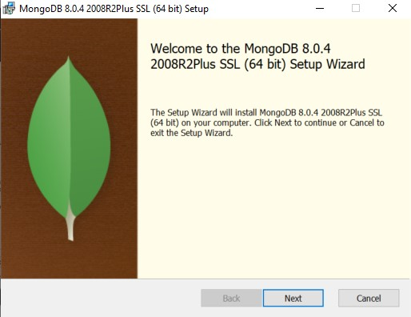</a>
  <br>
</p>

3. Acepta el acuerdo de licencia

<p align="center">
  <a href="https://github.com/AnthonyHMR/ITCR.BDAvanzados.Lab2/blob/main/docs/mongodb_guide.md" target="blank">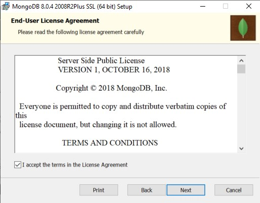</a>
  <br>
</p>

4. Selecciona "Complete" como tipo de instalación

<p align="center">
  <a href="https://github.com/AnthonyHMR/ITCR.BDAvanzados.Lab2/blob/main/docs/mongodb_guide.md" target="blank">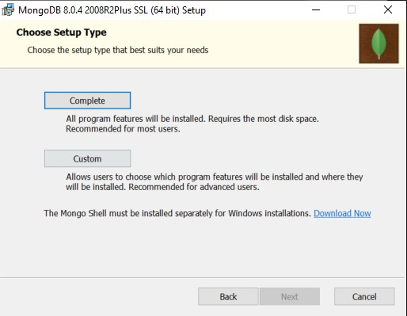</a>
  <br>
</p>

5. Configura el servicio de MongoDB:
   * Marca la opción "Install MongoDB as a Service"
   * Esto permitirá que MongoDB se ejecute automáticamente al iniciar Windows

<p align="center">
  <a href="https://github.com/AnthonyHMR/ITCR.BDAvanzados.Lab2/blob/main/docs/mongodb_guide.md" target="blank">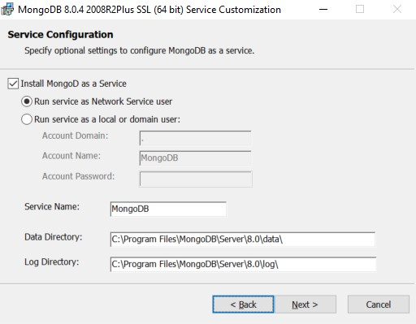</a>
  <br>
</p>

6. Instala MongoDB Compass (interfaz gráfica):
   * Se recomienda mantener esta opción seleccionada
   * Compass facilitará la administración visual de tus bases de datos

<p align="center">
  <a href="https://github.com/AnthonyHMR/ITCR.BDAvanzados.Lab2/blob/main/docs/mongodb_guide.md" target="blank">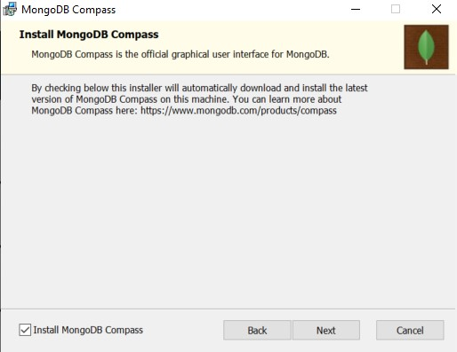</a>
  <br>
</p>

7. Inicia la instalación haciendo clic en "Install"

<p align="center">
  <a href="https://github.com/AnthonyHMR/ITCR.BDAvanzados.Lab2/blob/main/docs/mongodb_guide.md" target="blank">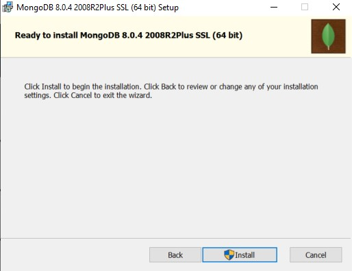</a>
  <br>
</p>

8. Al finalizar, se abrirá MongoDB Compass automáticamente

<p align="center">
  <a href="https://github.com/AnthonyHMR/ITCR.BDAvanzados.Lab2/blob/main/docs/mongodb_guide.md" target="blank">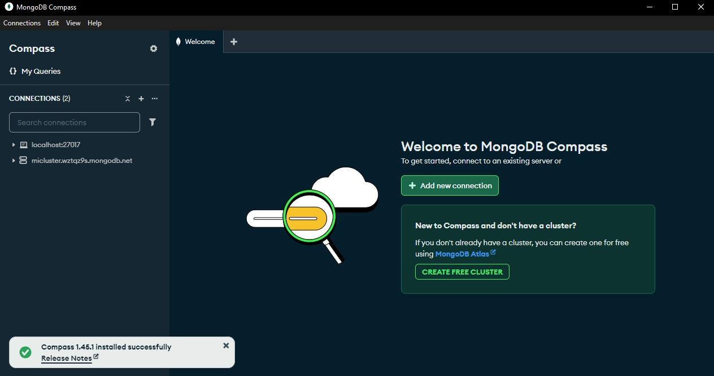</a>
  <br>
</p>

## Instalación de MongoDB Shell (mongosh)

### 1. Descarga de mongosh

1. Visita la [página de descarga de MongoDB Shell](https://www.mongodb.com/try/download/shell)
2. Descarga la versión más reciente para Windows
3. Extrae el archivo `mongosh-2.3.8-win32-x64.zip`

### 2. Configuración de mongosh

1. Navega hasta la carpeta extraída y accede al directorio `bin`

<p align="center">
  <a href="https://github.com/AnthonyHMR/ITCR.BDAvanzados.Lab2/blob/main/docs/mongodb_guide.md" target="blank">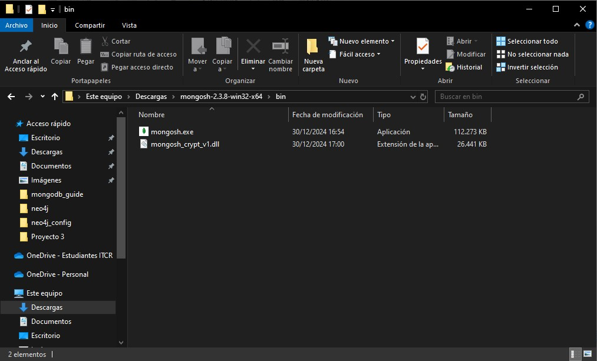</a>
  <br>
</p>

2. Obtén la ruta del ejecutable:
   * Click derecho en `mongosh.exe`
   * Selecciona "Propiedades"
   * Copia la ubicación del archivo

<p align="center">
  <a href="https://github.com/AnthonyHMR/ITCR.BDAvanzados.Lab2/blob/main/docs/mongodb_guide.md" target="blank">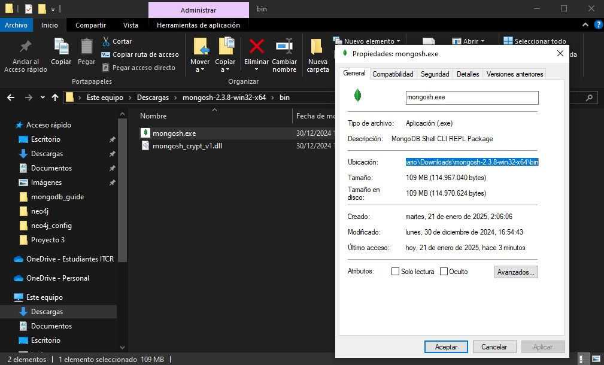</a>
  <br>
</p>

### 3. Configuración de Variables de Entorno

1. Abre las variables de entorno del sistema:
   * Busca "Variables de entorno" en el menú de inicio
   * O accede desde Propiedades del Sistema → Configuración avanzada

<p align="center">
  <a href="https://github.com/AnthonyHMR/ITCR.BDAvanzados.Lab2/blob/main/docs/mongodb_guide.md" target="blank">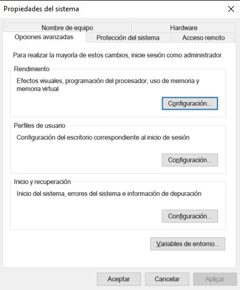</a>
  <br>
</p>

2. Agrega una nueva variable de sistema:
   * Nombre: `Mongosh`
   * Valor: [Ruta copiada anteriormente]

<p align="center">
  <a href="https://github.com/AnthonyHMR/ITCR.BDAvanzados.Lab2/blob/main/docs/mongodb_guide.md" target="blank">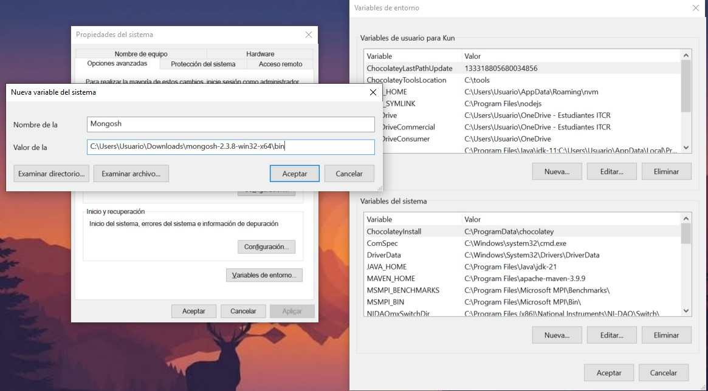</a>
  <br>
</p>

### 4. Verificación de la Instalación

1. Regresa a la carpeta de mongosh y ejecuta `mongosh.exe`
2. En la consola, escribe:

```bash
mongosh
```

3. Deberías ver la siguiente pantalla de bienvenida:

<p align="center">
  <a href="https://github.com/AnthonyHMR/ITCR.BDAvanzados.Lab2/blob/main/docs/mongodb_guide.md" target="blank">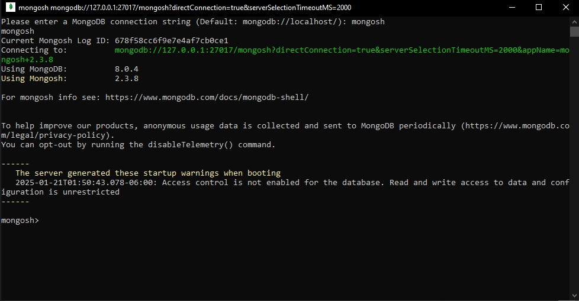</a>
  <br>
</p>

## Solución de Problemas Comunes

* Si MongoDB no inicia como servicio, verifica que el servicio esté habilitado en el administrador de servicios de Windows
* Si Compass no se conecta, asegúrate de que el servicio de MongoDB esté corriendo
* Si mongosh no es reconocido, verifica la variable de entorno y reinicia la terminal

## Recursos Adicionales

* [Documentación oficial de MongoDB](https://www.mongodb.com/docs/)
* [Manual de MongoDB Shell](https://www.mongodb.com/docs/mongodb-shell/)
* [Guías y Tutoriales](https://www.mongodb.com/docs/manual/tutorial/)