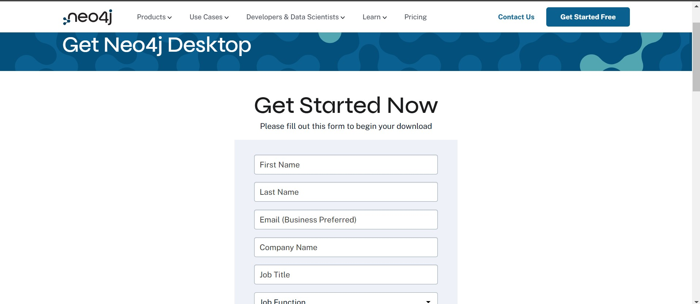
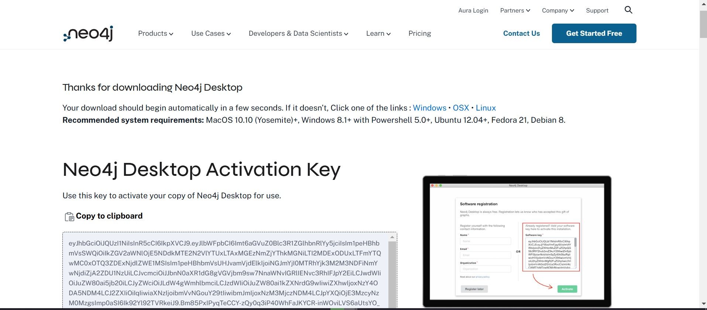
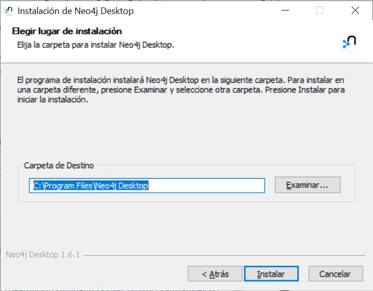
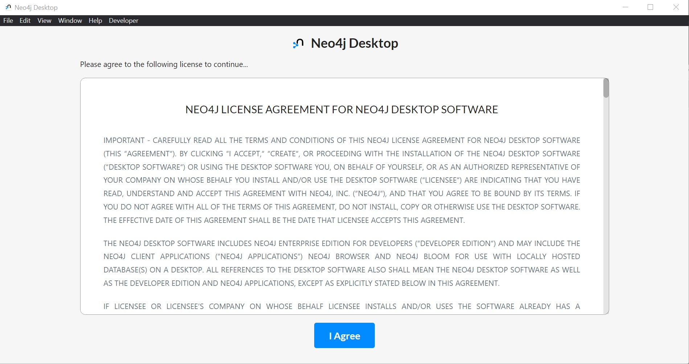
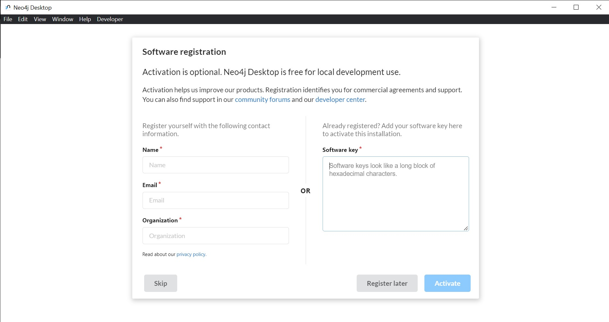
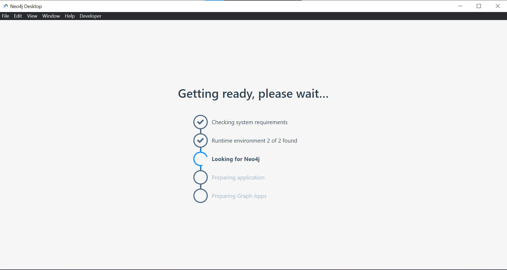
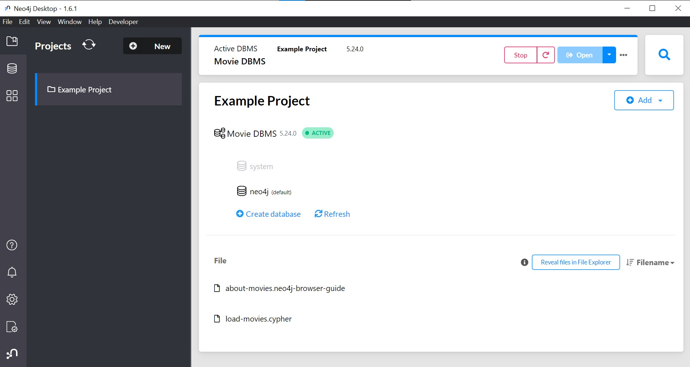

# Guía de Instalación de Neo4j Desktop

  
   

## Introducción
Neo4j Desktop es una plataforma de base de datos orientada a grafos que permite almacenar y consultar datos interconectados de manera eficiente. Esta guía te ayudará a instalar Neo4j Desktop en tu sistema local.

## Proceso de Instalación

### 1. Descarga de Software 

1. Ve a la página oficial de [Neo4j](https://neo4j.com/download/)
2. Haz clic en el botón "Download"
3. Completa el formulario de registro:
   - Nombre
   - Apellido
   - Email corporativo
   - Nombre de la empresa
   - Cargo
   - Número de teléfono
   - País

  
   

### 2. Preparación de la Instalación
4. Selecciona la ubicación donde guardar el archivo `Neo4j Desktop Setup 1.6.1.exe`
5. Guarda la `Neo4j Desktop Activation Key` que aparecerá en la página - la necesitarás más tarde

  
   

### 3. Proceso de Instalación
6. Ejecuta el archivo descargado `Neo4j Desktop Setup 1.6.1.exe`
7. Selecciona el directorio de instalación:
   - La ruta por defecto es recomendada para la mayoría de los usuarios
   - Asegúrate de tener permisos de escritura en la carpeta seleccionada

  
   

### 4. Configuración Inicial
8. Inicia Neo4j Desktop una vez completada la instalación
9. Lee y acepta los términos de la licencia (esto es requerido para continuar)

  
   

### 5. Activación del Software
10. En la pantalla de registro, tienes dos opciones:
    - Introduce la `Neo4j Desktop Activation Key` que guardaste anteriormente
    - O haz clic en `skip` para usar la versión gratuita con funcionalidades limitadas

  
   

### 6. Finalización
11. Espera mientras el sistema completa la configuración inicial del entorno
    - Este proceso puede tomar varios minutos
    - No cierres la aplicación durante esta etapa

  
   

12. Una vez completado, verás la interfaz principal de Neo4j Desktop

  
   

## Recursos Adicionales
- [Documentación oficial de Neo4j](https://neo4j.com/docs/)
- [Guía de inicio rápido](https://neo4j.com/developer/get-started/)
- [Neo4j Community](https://community.neo4j.com/)

Presionar en New para generar un nuevo proyecto. Por defecto este tiene el nombre de Project, pero usted lo modifica y le coloca una contraseña. 
Presionar en start
Luego vaya a los tres puntos, presiona en Open folder y luego en import
Ahí agrega el archivo .csv

