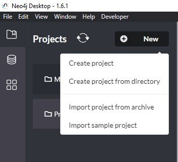
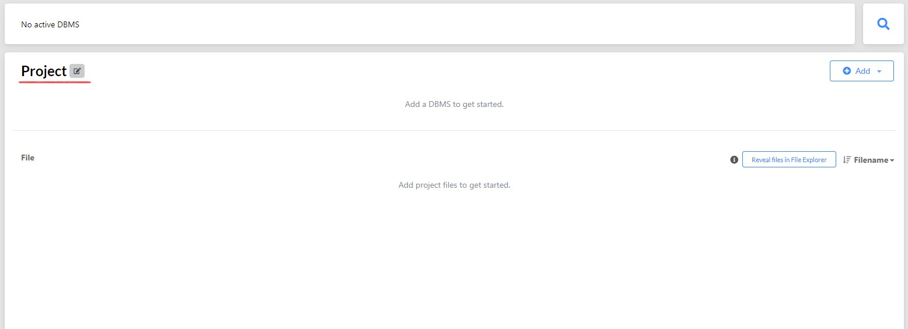
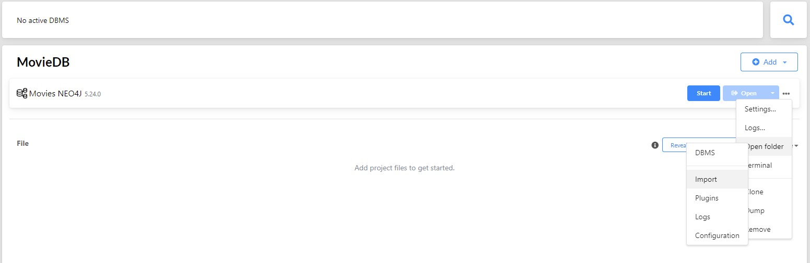
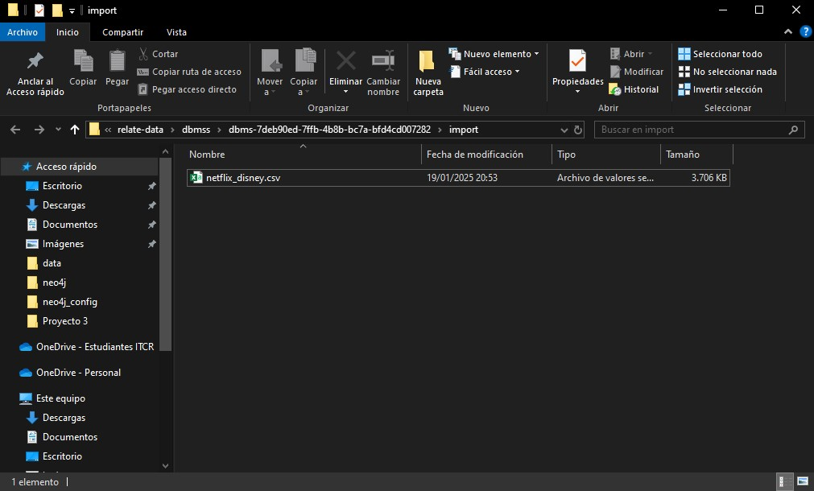
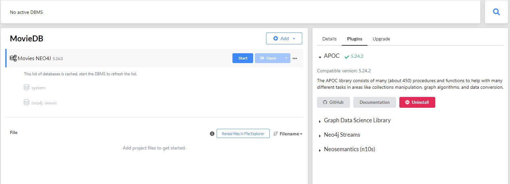
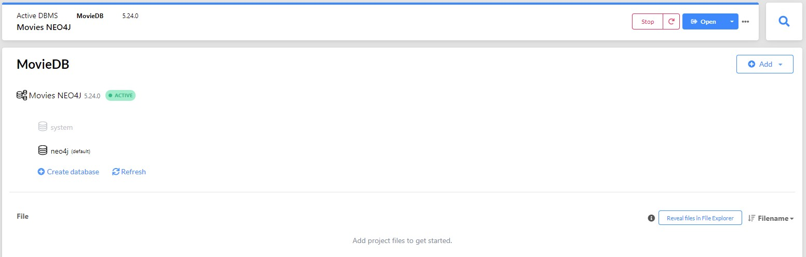
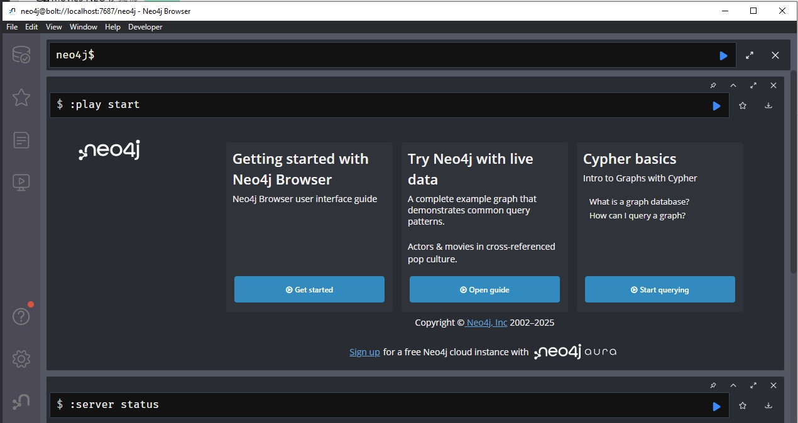
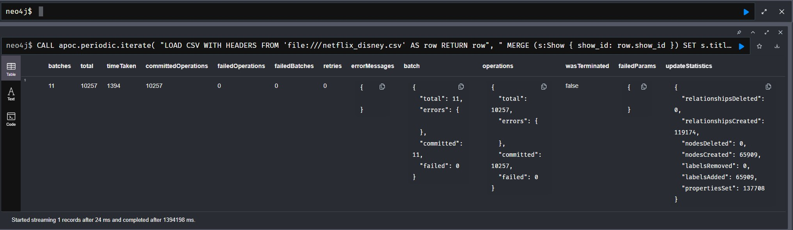
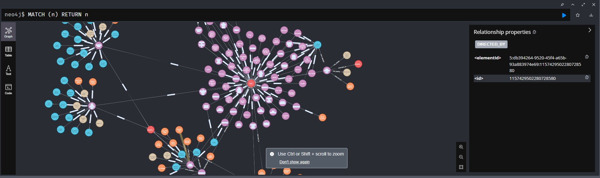

# Guía de Configuración de Neo4j Desktop

## Requisitos Previos

* Neo4j Desktop instalado
* Archivo [netflix_disney.csv](https://github.com/AnthonyHMR/ITCR.BDAvanzados.Lab2/blob/main/data/netflix_disney.csv) descargado
* Permisos de administrador en tu sistema

## Pasos de Configuración

### 1. Crear un Nuevo Proyecto

1. En el panel izquierdo, localiza la sección "Projects"
2. Haz clic en el botón `New` para crear un nuevo proyecto

<p align="center">
  <a href="https://github.com/AnthonyHMR/ITCR.BDAvanzados.Lab2/blob/main/docs/neo4j_config.md" target="blank"></a>
  <br>
</p>

### 2. Configurar el Proyecto

1. Asigna un nombre al proyecto (por ejemplo, "MovieDB")
2. El nombre puede ser modificado según tus preferencias

<p align="center">
  <a href="https://github.com/AnthonyHMR/ITCR.BDAvanzados.Lab2/blob/main/docs/neo4j_config.md" target="blank"></a>
  <br>
</p>

### 3. Importar Datos

1. Localiza el menú de tres puntos (⋮)
2. Selecciona la opción `Import`

<p align="center">
  <a href="https://github.com/AnthonyHMR/ITCR.BDAvanzados.Lab2/blob/main/docs/neo4j_config.md" target="blank"></a>
  <br>
</p>

### 4. Seleccionar Archivo de Datos

1. En el explorador de archivos, navega hasta la ubicación del archivo [netflix_disney.csv](https://github.com/AnthonyHMR/ITCR.BDAvanzados.Lab2/blob/main/data/netflix_disney.csv)
2. Selecciona el archivo y confirma la importación
3. Regresa a la ventana principal de Neo4j

<p align="center">
  <a href="https://github.com/AnthonyHMR/ITCR.BDAvanzados.Lab2/blob/main/docs/neo4j_config.md" target="blank"></a>
  <br>
</p>

### 5. Instalación de Plugins

1. Navega a la sección de plugins
2. Localiza la librería APOC
3. Procede con la instalación

<p align="center">
  <a href="https://github.com/AnthonyHMR/ITCR.BDAvanzados.Lab2/blob/main/docs/neo4j_config.md" target="blank"></a>
  <br>
</p>


### 6. Iniciar la Base de Datos

1. Presiona el botón `Start` para inicializar la base de datos
2. Una vez iniciada, haz clic en `Open` para acceder a Neo4j Browser

<p align="center">
  <a href="https://github.com/AnthonyHMR/ITCR.BDAvanzados.Lab2/blob/main/docs/neo4j_config.md" target="blank"></a>
  <br>
</p>

### 7. Importación de Datos en Neo4j Browser

1. Accede a Neo4j Browser
2. Copia y pega el siguiente código Cypher [import_data.cypher](https://github.com/AnthonyHMR/ITCR.BDAvanzados.Lab2/blob/main/data/neo4j/import_data.cypher):


<p align="center">
  <a href="https://github.com/AnthonyHMR/ITCR.BDAvanzados.Lab2/blob/main/docs/neo4j_config.md" target="blank"></a>
  <br>
</p>

```bash
CALL apoc.periodic.iterate(
  "LOAD CSV WITH HEADERS FROM 'file:///netflix_disney.csv' AS row RETURN row",
  "
  MERGE (s:Show { show_id: row.show_id })
  SET 
      s.title        = row.title,
      s.type         = row.type,
      s.date_added   = row.date_added,
      s.release_year = toInteger(row.release_year),
      s.rating       = row.rating,
      s.duration     = row.duration,
      s.description  = row.description
  
  FOREACH (dir IN CASE 
                  WHEN row.director IS NOT NULL AND row.director <> '' 
                  THEN split(row.director, ',') 
                  ELSE [] 
                END | 
      MERGE (d:Director { name: trim(dir) })
      MERGE (s)-[:DIRECTED_BY]->(d)
  )

  FOREACH (actor IN CASE 
                   WHEN row.cast IS NOT NULL AND row.cast <> '' 
                   THEN split(row.cast, ',') 
                   ELSE [] 
                   END |
      MERGE (a:Actor { name: trim(actor) })
      MERGE (s)-[:CAST_MEMBER]->(a)
  )

  FOREACH (cn IN CASE
                 WHEN row.country IS NOT NULL AND row.country <> ''
                 THEN split(row.country, ',')
                 ELSE []
                 END |
      MERGE (c:Country { name: trim(cn) })
      MERGE (s)-[:AVAILABLE_IN]->(c)
  )

  FOREACH (gen IN CASE
                  WHEN row.listed_in IS NOT NULL AND row.listed_in <> ''
                  THEN split(row.listed_in, ',')
                  ELSE []
                  END |
      MERGE (g:Genre { name: trim(gen) })
      MERGE (s)-[:HAS_GENRE]->(g)
  )
  ",
  {batchSize:1000, iterateList:true, parallel:false}
)
```

> **Nota**: La importación puede tomar varios minutos dependiendo del volumen de datos.

### 8. Verificación de la Importación

Una vez completada la importación, deberías ver un mensaje de confirmación:

<p align="center">
  <a href="https://github.com/AnthonyHMR/ITCR.BDAvanzados.Lab2/blob/main/docs/neo4j_config.md" target="blank"></a>
  <br>
</p>

### 9. Visualización de Datos

Para verificar la correcta importación, ejecuta la siguiente consulta:

```cypher
MATCH (n) RETURN n;
```

Esto mostrará aproximadamente 300 nodos interrelacionados (limitado por la visualización):

<p align="center">
  <a href="https://github.com/AnthonyHMR/ITCR.BDAvanzados.Lab2/blob/main/docs/neo4j_config.md" target="blank"></a>
  <br>
</p>

## Solución de Problemas Comunes

* Si la importación falla, verifica que el archivo CSV esté en la ubicación correcta
* Asegúrate de que APOC esté correctamente instalado antes de ejecutar la importación
* La visualización está limitada a 300 nodos por defecto por razones de rendimiento